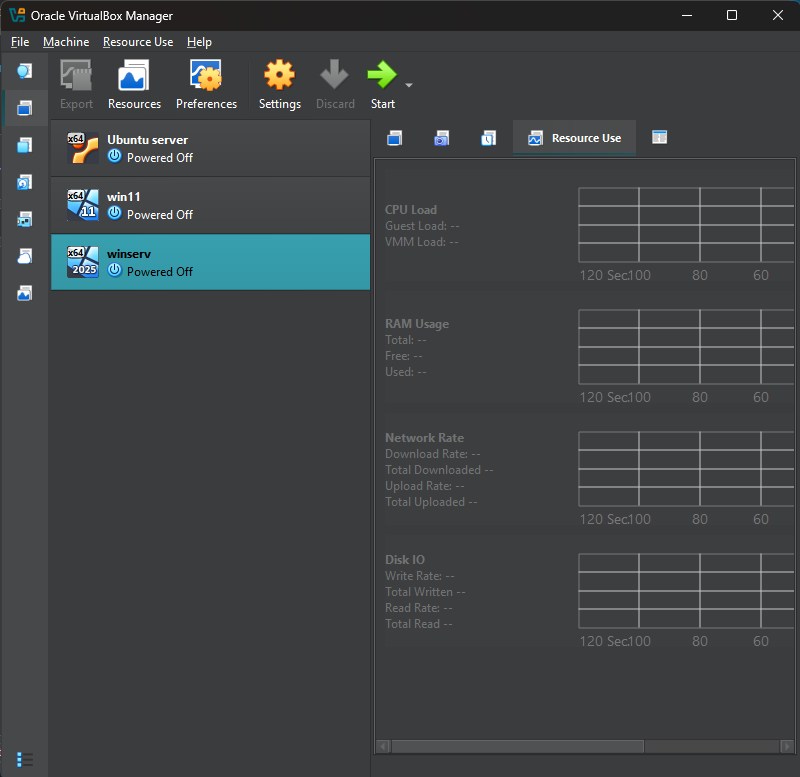
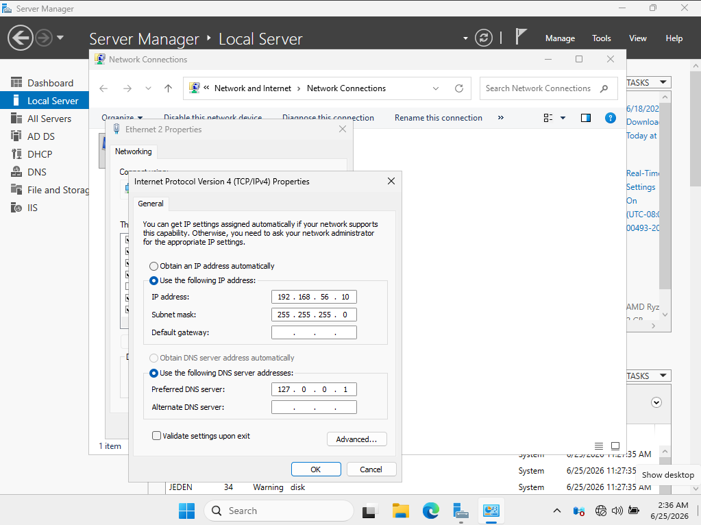
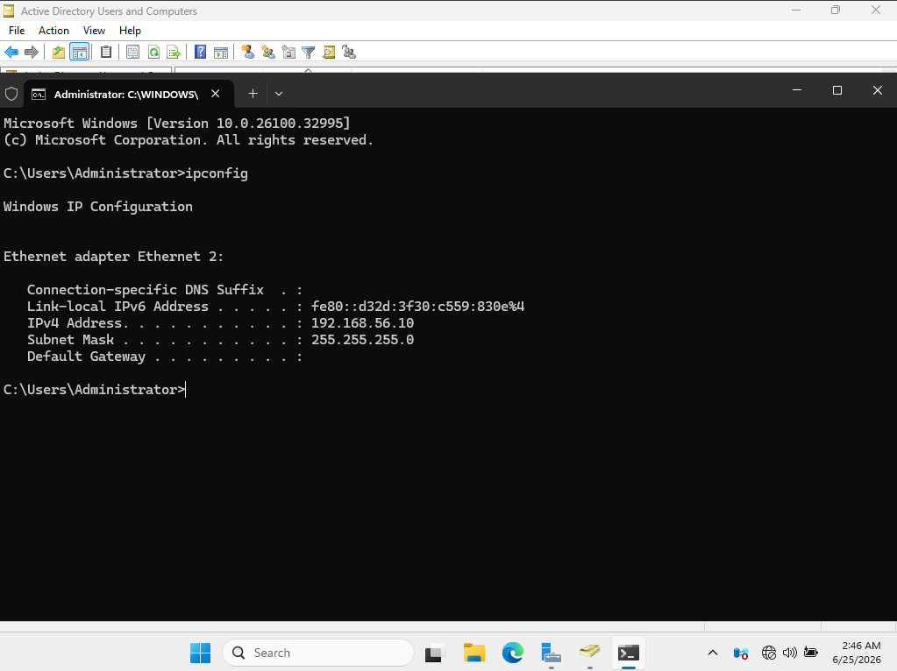
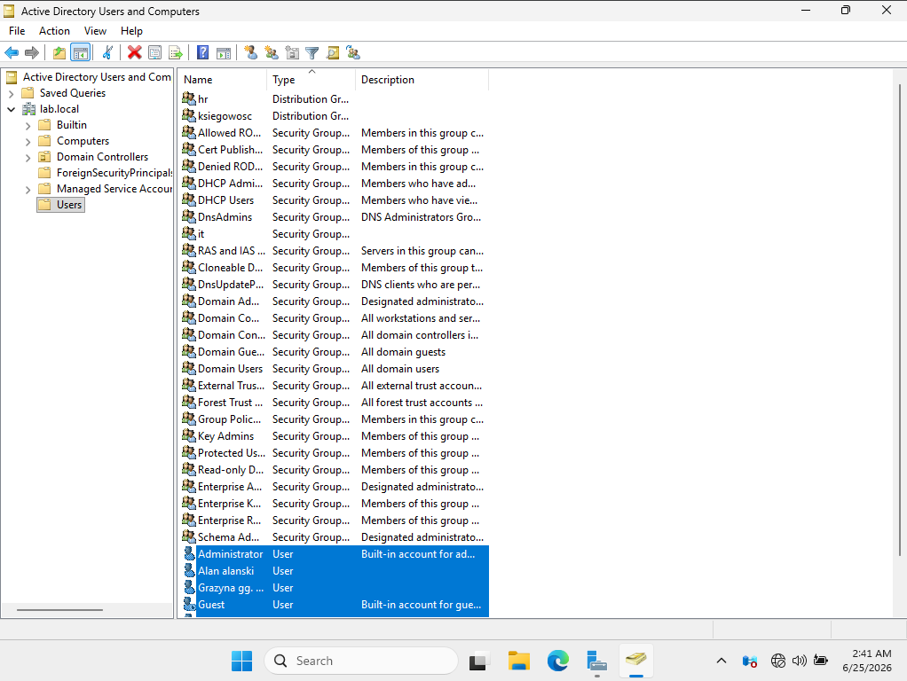
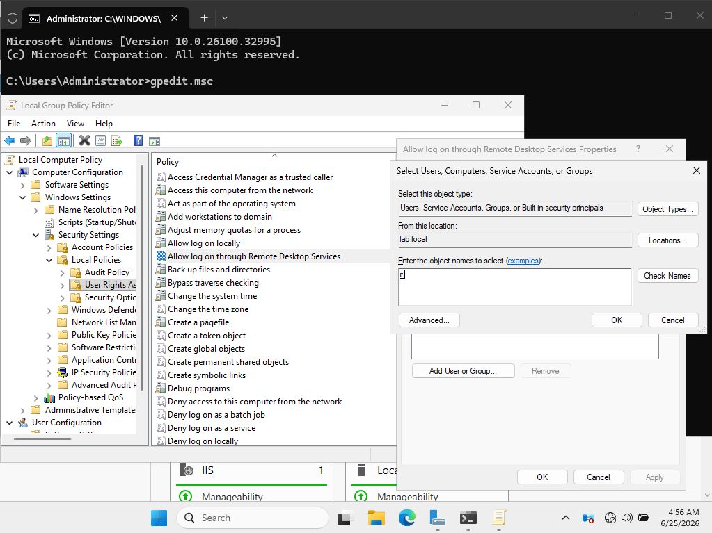
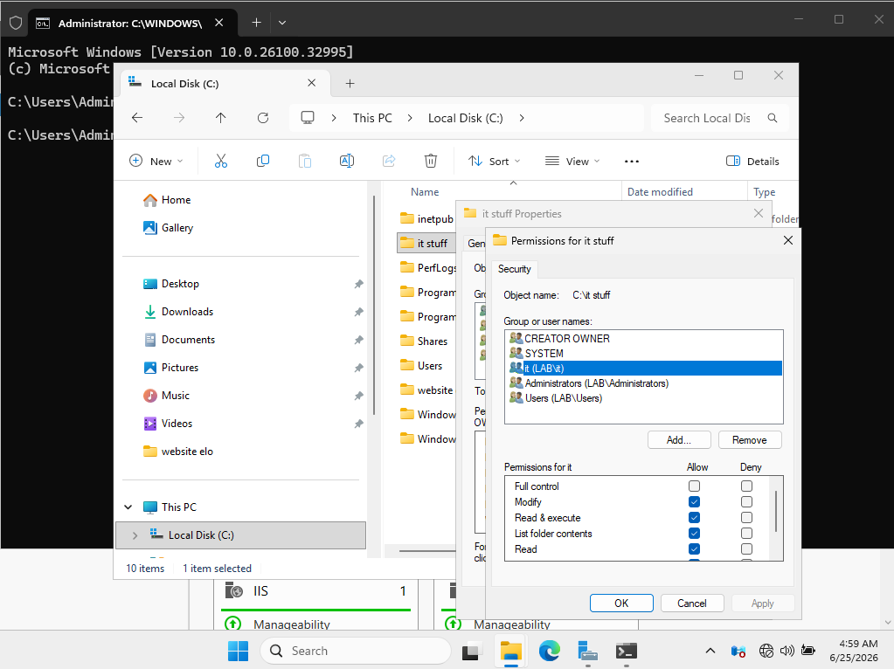
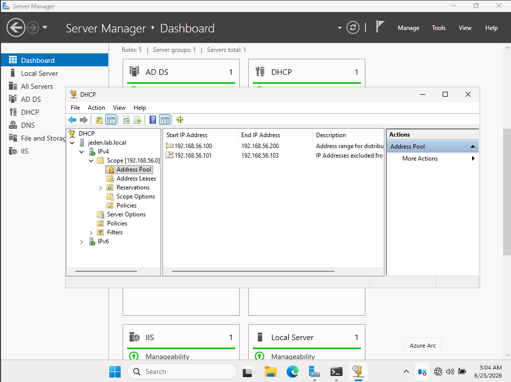
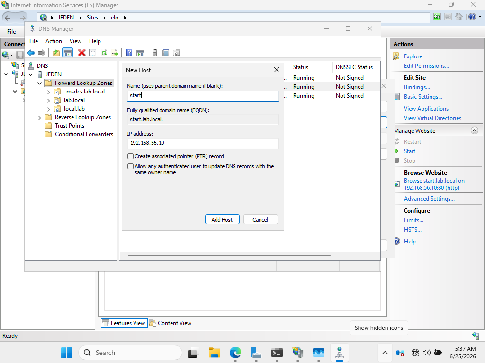
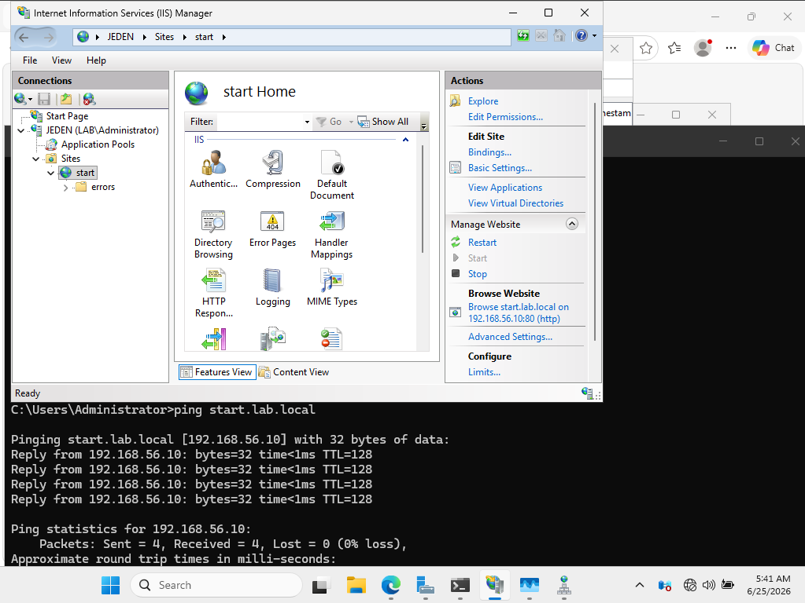
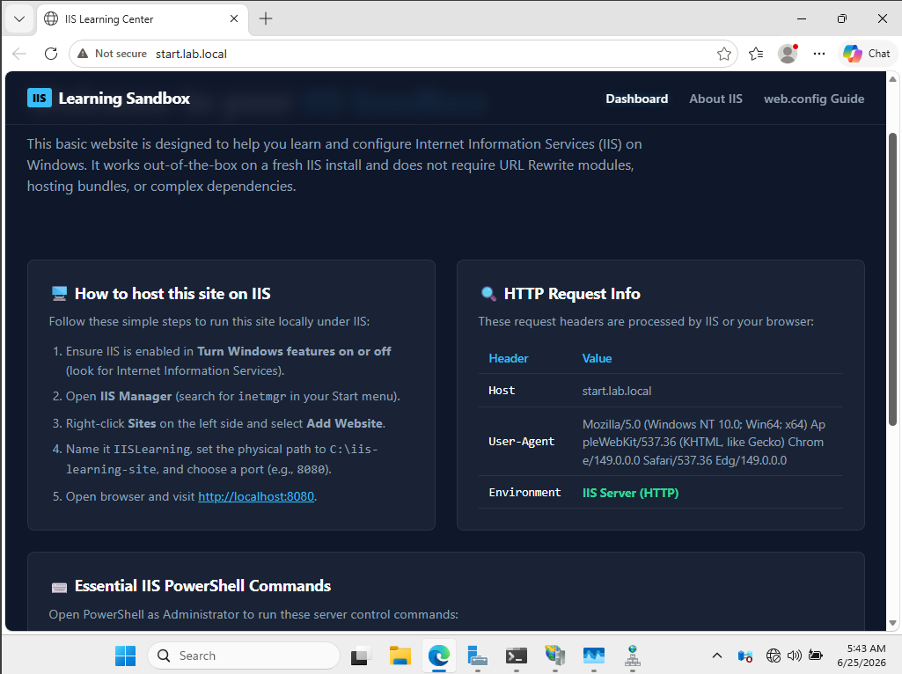

# **Summary of things i learned using Oracle VirtualBox, free license Windows server 2025 and Active Directory in a home set up:**

- Learning basics about networks, and commonly used commands (ping, tracert, ipconfig etc.)
- Setting up VM`s with win11, windows server 2025 and ubuntu server

- Setting up a server with a static ip configured manually and domain setup

- Installing Active Directory with additional tools:
  * Managing user accounts and giving them various privilages
  
  
  
  * Group policy managment

  

  * Sharing folders

  
  
  * Configuring a DHCP server and a custom ip range

  
  
  * Configuring a DNS server

  
  
  * Hosting a basic local domain website (created using Antigravity) and making it accesible for users with IIS

  
  
